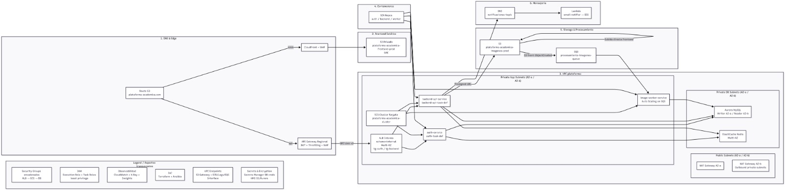

# LMS Infrastructure (IaC)

Infraestructura como codigo para un LMS en AWS usando Terraform + Ansible.

## Equipo

- Gonzales Soto Alex (DevOps)
- Tisnado Guevara Anthony (Arquitectura Cloud)

## Identificación del problema

El LMS se plantea como una plataforma educativa 100% en línea, sin sedes físicas, orientada a centralizar cursos, tareas y seguimiento académico en un solo entorno. Para la primera etapa, el alcance esperado es de 15 a 25 cursos activos en el primer año, con una base aproximada de 600 estudiantes y 40 docentes, además de picos de hasta 120 usuarios concurrentes en exámenes y entregas.
A nivel económico, se proyecta una meta conservadora de S/ 18,000 a S/ 30,000 anuales, mediante suscripciones institucionales y convenios educativos, en coherencia con un despliegue inicial en AWS y operación técnica controlada.
El problema principal no es solo publicar contenido, sino asegurar que la plataforma funcione con disponibilidad, respuesta estable en picos, protección de datos académicos y crecimiento gradual sin rehacer toda la infraestructura. Por ello, desde esta etapa se requiere definir requerimientos no funcionales claros de escalabilidad, seguridad, confiabilidad y monitoreo.

## Objetivo

- Provisionar infraestructura reproducible con Terraform.
- Desplegar servicios en ECS Fargate.
- Integrar almacenamiento, base de datos y mensajeria.
- Mantener despliegue legible y operable para entorno academico.

## 2. Requerimientos no funcionales (ISO/IEC 25010)

| ID | Atributo ISO 25010 | Requerimiento No Funcional | Metrica / Criterio de aceptacion | Prioridad (MoSCoW) | Tecnologias AWS / Conceptos |
|---|---|---|---|---|---|
| RNF-01 | Fiabilidad - Disponibilidad | El backend debe permanecer operativo para atender trafico academico continuo. | `runningCount == desiredCount` en `lms-backend-service-dev` durante despliegue. | MUST | ECS Fargate, `aws ecs wait services-stable`, Ansible |
| RNF-02 | Fiabilidad - Madurez | El frontend, backend y auth deben exponer checks de salud consistentes. | Target groups con `matcher=200`, `interval=30s`, `timeout=5s`, `healthy_threshold=2`. | MUST | ALB Target Groups, health checks HTTP |
| RNF-03 | Rendimiento - Eficiencia temporal | La latencia promedio del balanceador no debe degradar la experiencia en uso normal. | Alarma `alb_response_time_high` cuando `TargetResponseTime > 2s` por 2 periodos de 5 min. | MUST | CloudWatch Alarm, ALB |
| RNF-04 | Rendimiento - Uso de recursos | El backend debe controlar consumo de CPU bajo carga sostenida. | Alarma `backend_cpu_high` cuando `CPUUtilization > 80%` por 10 min. | MUST | ECS, CloudWatch |
| RNF-05 | Rendimiento - Uso de recursos | El backend debe controlar consumo de memoria para evitar inestabilidad. | Alarma `backend_memory_high` cuando `MemoryUtilization > 85%` por 10 min. | MUST | ECS, CloudWatch |
| RNF-06 | Escalabilidad | El frontend debe escalar automaticamente segun demanda de CPU. | Target tracking `ECSServiceAverageCPUUtilization=70`, `scale_out=60s`, `scale_in=300s`. | MUST | ECS Auto Scaling |
| RNF-07 | Escalabilidad | El backend debe escalar automaticamente segun demanda de CPU. | Target tracking `ECSServiceAverageCPUUtilization=70`, `scale_out=60s`, `scale_in=300s`. | MUST | ECS Auto Scaling |
| RNF-08 | Escalabilidad | El worker de imagenes debe escalar por backlog de cola. | Target tracking SQS con `ApproximateNumberOfMessagesVisible` y `target_value=5`. | MUST | SQS, ECS Auto Scaling |
| RNF-09 | Capacidad | En entorno `dev`, los servicios deben operar con costo controlado y capacidad minima definida. | `terraform.tfvars`: frontend/auth/worker `desired=0`, backend `desired=1`, maximos en 1. | MUST | Terraform variables, ECS |
| RNF-10 | Seguridad - Confidencialidad | Datos en S3 deben almacenarse cifrados en reposo. | Buckets criticos con `sse_algorithm=aws:kms` y clave KMS dedicada. | MUST | S3 SSE-KMS, AWS KMS |
| RNF-11 | Seguridad - Confidencialidad | Credenciales de BD no deben estar hardcodeadas en contenedores ni playbooks. | Uso de `aws_secretsmanager_secret` y `valueFrom` en task definitions ECS. | MUST | AWS Secrets Manager, ECS Secrets |
| RNF-12 | Seguridad - Aislamiento de red | Cargas de aplicacion deben ejecutarse en subredes privadas sin IP publica. | `assign_public_ip=false` en servicios ECS y ALB interno en subredes privadas. | MUST | VPC, Subnets privadas, ECS, ALB interno |
| RNF-13 | Seguridad - Control de acceso | El acceso entre servicios debe regirse por minimo privilegio en IAM. | Politicas separadas para ECS y Lambda (S3, SQS, SNS, Secrets, KMS) con permisos acotados. | MUST | IAM Roles/Policies |
| RNF-14 | Seguridad - Proteccion perimetral | El trafico HTTP debe poder protegerse con reglas administradas de WAF. | Si `enable_waf=true`, WebACL asociado al ALB. | SHOULD | AWS WAFv2, ALB |
| RNF-15 | Seguridad - Proteccion en transito | El sistema debe permitir transicion a HTTPS sin redisenio mayor. | Si `enable_https_listener=true`, habilita listener HTTPS y redirect HTTP->HTTPS. | SHOULD | ALB Listeners, TLS |
| RNF-16 | Fiabilidad - Recuperabilidad | Mensajes fallidos no deben perderse y deben enviarse a cola de recuperacion. | Colas principales con `redrive_policy` hacia `notifications_dlq`. | MUST | SQS, DLQ |
| RNF-17 | Mantenibilidad - Operabilidad | Logs de ejecucion deben centralizarse y conservarse con politica definida. | Log groups ECS en CloudWatch y retencion configurada a 7 dias en Ansible. | MUST | CloudWatch Logs, Ansible |
| RNF-18 | Monitoreo / Observabilidad | El sistema debe alertar degradaciones de cola, base de datos y aplicacion. | Alarmas activas para DLQ, backlog SQS, CPU ECS/Aurora, latencia y 5xx ALB. | MUST | CloudWatch Alarms, Dashboard |
| RNF-19 | Compatibilidad - Interoperabilidad | La plataforma debe integrar flujos asincronos entre servicios sin acoplamiento fuerte. | S3->SQS->ECS Worker y SQS->Lambda->SNS/SES implementados por recursos Terraform. | SHOULD | S3 Events, SQS, Lambda, SNS, SES |
| RNF-20 | Mantenibilidad - Desplegabilidad | Cada cambio debe pasar una ruta de despliegue reproducible y verificable. | Pipeline con `fmt/validate/plan/apply`, artefactos `tfplan`, deploy y health checks en Ansible. | MUST | Jenkins Pipeline, Terraform, Ansible |

## Estructura del repositorio

```text
ProyectoLMSFinal/
├─ back/                     # Backend Node.js
├─ front/                    # Frontend estatico (Nginx)
├─ infra/
│  ├─ terraform/             # IaC principal AWS
│  ├─ ansible/               # Operacion/despliegue
│  └─ tf/                    # Sandbox simple (no productivo)
├─ terratest/                # Tests de IaC
└─ docs/
   ├─ ARCHITECTURE.md
   └─ PROJECT_STRUCTURE.md
```

Notas:
- El pipeline CI/CD usa `infra/terraform` como ruta principal.
- `infra/tf` se mantiene como ejemplo/sandbox.

## Arquitectura y diagrama

- Diagrama Configuracion: `docs/ARCHITECTURE.md`
- Incluye configuracion ECS Fargate por servicio:
  - `desired_count`
  - `min_capacity`
  - `max_capacity`

Este diagrama representa la arquitectura desplegada del LMS en AWS: entrada por Route 53/CloudFront/WAF hacia ALB interno, servicios en ECS Fargate, capa de datos (Aurora/ElastiCache), mensajeria (SQS/SNS), procesamiento asincrono con Lambda y operacion automatizada con Terraform + Ansible + Jenkins.



## Lambdas (nombres claros)

Se estandarizaron nombres de funciones e integraciones en español:

- `ingestor_eventos_aprendizaje` (API Gateway -> Lambda -> EventBridge)
- `procesador_archivos_entregas` (S3 -> Lambda)
- `despachador_notificaciones` (SQS -> Lambda -> SNS)
- `despachador_correos` (SQS -> Lambda -> SES)

## Configuracion ECS/Fargate

Los minimos y maximos ya no estan hardcodeados en `ecs.tf`.
Ahora se definen en variables:

- `frontend_min_capacity`, `frontend_max_capacity`
- `backend_min_capacity`, `backend_max_capacity`
- `worker_min_capacity`, `worker_max_capacity`

Para `dev` (bajo costo), `infra/terraform/terraform.tfvars` usa:

- desired = `0`
- min = `0`
- max = `1`

## Flujo recomendado

### Terraform

```bash
cd infra/terraform
terraform init
terraform validate
terraform plan
terraform apply
```

### Ansible

```bash
cd infra/ansible
ansible-playbook playbook.yaml -e "env=dev"
```

### Script de apoyo

```bash
infra/ansible/scripts/deploy.sh dev deploy
```

## Pipeline CI/CD (Jenkins)

El `jenkinsfile` ahora ejecuta este flujo:

1. `Preflight`: valida herramientas requeridas.
2. `CI Backend`: instala dependencias y ejecuta `lint/test`.
3. `CI Frontend`: valida estructura minima de frontend.
4. `Terraform Validate`: `fmt`, `init` y `validate`.
5. `Terraform Plan`: genera `tfplan` y `tfplan.txt`.
6. `Aprobacion Manual` (opcional).
7. `Terraform Apply`.
8. `Build y Push Docker` (opcional, via Ansible).
9. `Deploy ECS + Healthcheck` (opcional, via Ansible).

Parametros principales:

- `targetEnvironment`: `dev`, `staging` o `prod`.
- `awsAccountId`: cuenta AWS para ECR.
- `autoApprove`: omite aprobacion manual.
- `buildImages`: habilita build/push de imagenes.
- `deployServices`: habilita deploy ECS y health check.

## Observaciones de organizacion aplicadas

- Se corrigieron rutas rotas entre carpetas (`front`, `back`, `infra/terraform`).
- Se alinearon nombres de templates Ansible con archivos reales.
- Se agrego `front/nginx.conf` y se completo `front/dockerfile`.
