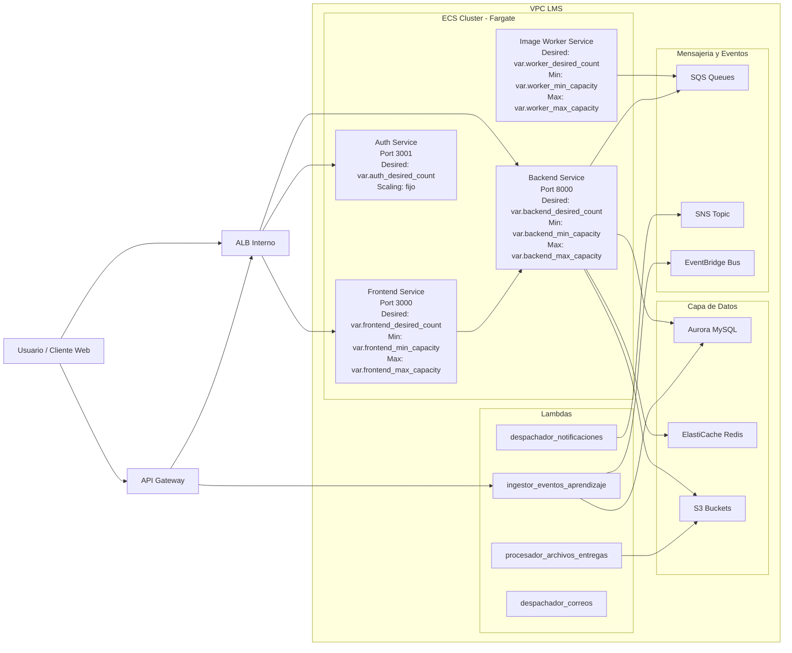

# Arquitectura LMS (IaC)

Este documento muestra la arquitectura principal y, en especial, la configuracion de tareas ECS Fargate por servicio.

## Diagrama

## Configuracion Fargate por defecto (variables.tf)

| Servicio | Desired | Min | Max |
|----------|---------|-----|-----|
| Frontend | `2` | `1` | `4` |
| Backend | `2` | `1` | `4` |
| Auth | `1` | N/A | N/A |
| Image Worker | `1` | `1` | `6` |

## Configuracion de bajo costo (terraform.tfvars dev)

| Servicio | Desired | Min | Max |
|----------|---------|-----|-----|
| Frontend | `0` | `0` | `1` |
| Backend | `0` | `0` | `1` |
| Auth | `0` | N/A | N/A |
| Image Worker | `0` | `0` | `1` |
